# 架构说明

本文档描述 `rtc-media-server` 的目标系统架构、单 Session 细粒度架构、媒体数据流和控制消息流。开发边界和实现规则见 [架构设计与开发规则](Design.md)。

## 架构图

- [全局架构 Mermaid 图源](uml/global-architecture.mmd)
- [Session 细粒度 Mermaid 图源](uml/session-detail.mmd)
- [联调时序 Mermaid 图源](uml/stream-sequence.mmd)

这些图使用 Mermaid 编写。下面的 Mermaid 代码块可在支持 Mermaid 的 Markdown 预览中直接渲染，`docs/uml/*.mmd` 是独立图源。

### 全局架构图

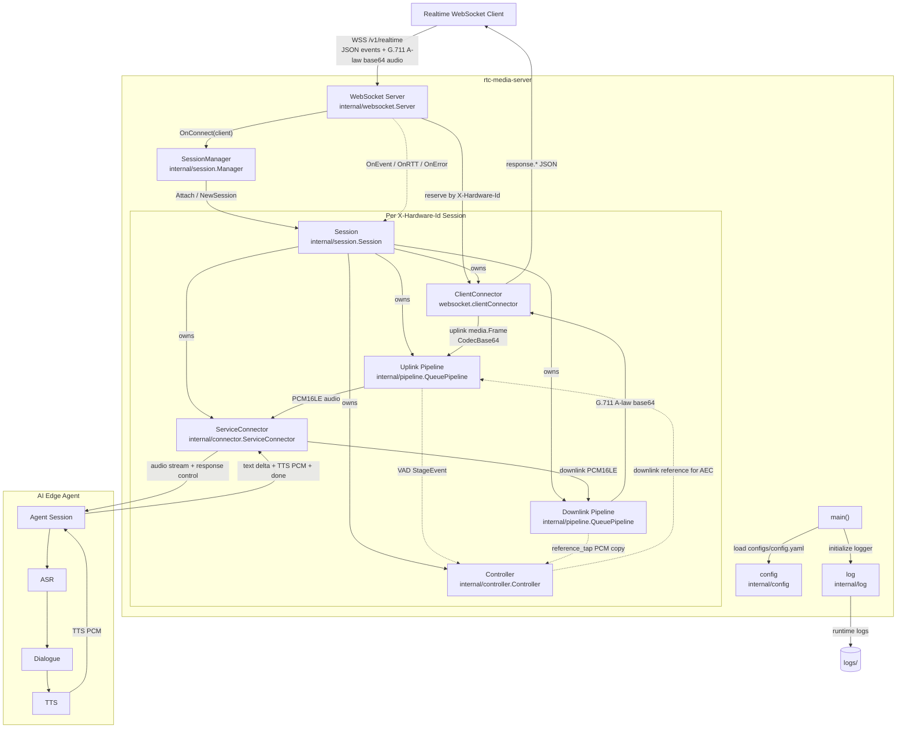

### Session 细粒度架构图

```mermaid
flowchart LR
    Client["Realtime WebSocket Client"]
    ClientConnector["websocket.clientConnector"]
    Session["session.Session"]
    Controller["controller.Controller"]
    ServiceConnector["connector.ServiceConnector"]

    subgraph Uplink["Uplink Pipeline"]
        Base64Decode["base64_decode"]
        ALawDecode["alaw_decode"]
        AudioEnhancement["audio_enhancement<br/>AEC / AGC / ANS"]
        VAD["vad"]
    end

    subgraph Agent["AI Edge Agent"]
        AgentSession["Agent Session"]
        ASR["ASR"]
        Dialogue["Dialogue"]
        TTS["TTS"]
    end

    subgraph Downlink["Downlink Pipeline"]
        PCMNormalize["pcm_normalize"]
        ReferenceTap["reference_tap"]
        ALawEncode["alaw_encode"]
        Base64Encode["base64_encode"]
    end

    Client -->|"input_audio_buffer.append<br/>audio = G.711 A-law base64"| ClientConnector
    ClientConnector -->|"media.Frame<br/>CodecBase64"| Base64Decode
    Base64Decode -->|"G.711 A-law bytes"| ALawDecode
    ALawDecode -->|"PCM16LE"| AudioEnhancement
    AudioEnhancement -->|"enhanced PCM16LE"| VAD
    VAD -->|"PCM16LE audio"| ServiceConnector

    VAD -.->|"speech_started<br/>speech_stopped<br/>silence_timeout"| Controller
    Controller -.->|"OnStageEvent / CloseSession"| Session
    Session -->|"connector.Message"| ClientConnector
    ClientConnector -->|"session / speech / response JSON"| Client

    Client -->|"session.update<br/>input_audio_buffer.commit<br/>response.create<br/>response.cancel"| ClientConnector
    ClientConnector -->|"connector.Message"| Session
    Session -->|"response control"| ServiceConnector

    ServiceConnector -->|"audio stream + control"| AgentSession
    AgentSession --> ASR
    ASR --> Dialogue
    Dialogue --> TTS
    TTS -->|"TTS PCM"| AgentSession
    AgentSession -->|"text delta + TTS PCM + done"| ServiceConnector

    ServiceConnector -->|"text delta / done"| Session
    ServiceConnector -->|"downlink PCM16LE"| Session
    Session -->|"EnqueueDownlink"| PCMNormalize
    PCMNormalize -->|"normalized PCM16LE"| ReferenceTap
    ReferenceTap -->|"PCM16LE"| ALawEncode
    ALawEncode -->|"G.711 A-law bytes"| Base64Encode
    Base64Encode -->|"CodecBase64"| ClientConnector
    ClientConnector -->|"response.audio.delta"| Client

    ReferenceTap -.->|"OnDownlinkReference"| Controller
    Controller -.->|"AddReference"| AudioEnhancement
    Session -.->|"RTT getter"| AudioEnhancement
```

### 联调时序图

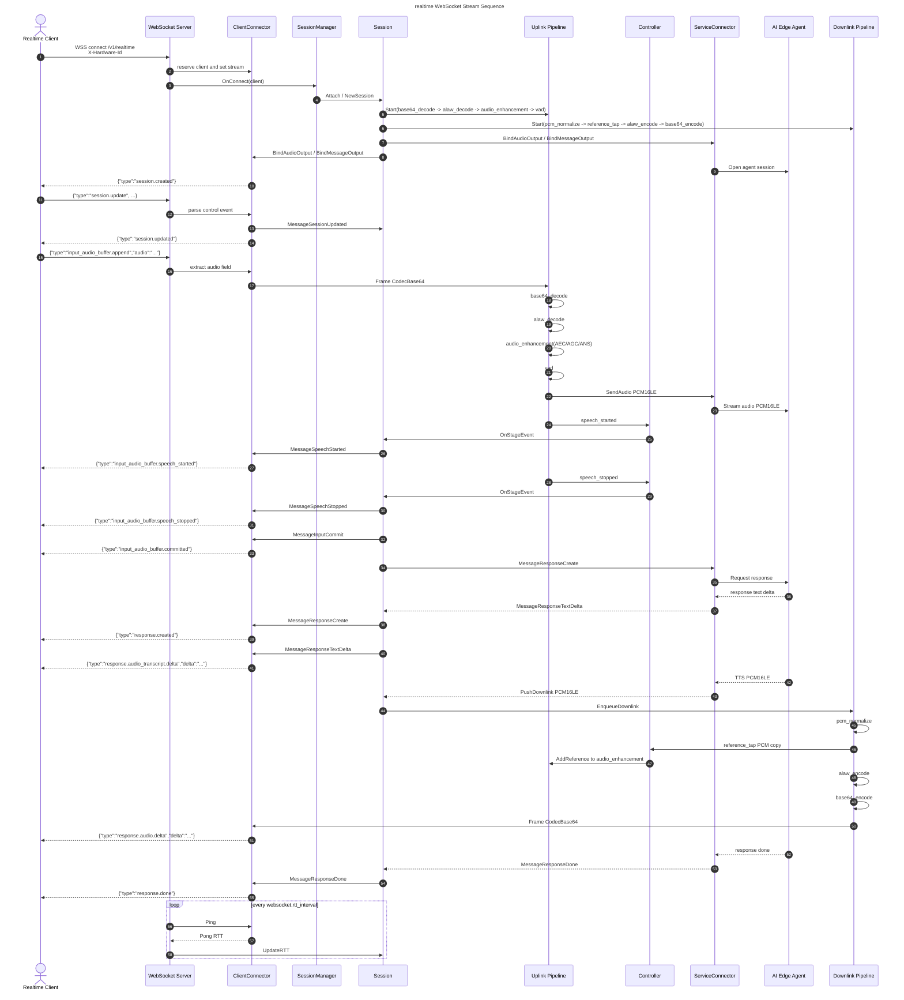

## 全局架构

服务入口位于 `cmd/rtc-media-server/main.go`，启动时完成配置加载、日志初始化、TLS 证书准备、`SessionManager` 创建和 `WebSocket Server` 启动。每个端侧 realtime 连接对应一个业务 `Session`，`Session` 通过 `ServiceConnector` 连接 AI Edge Agent。

整体组件关系：

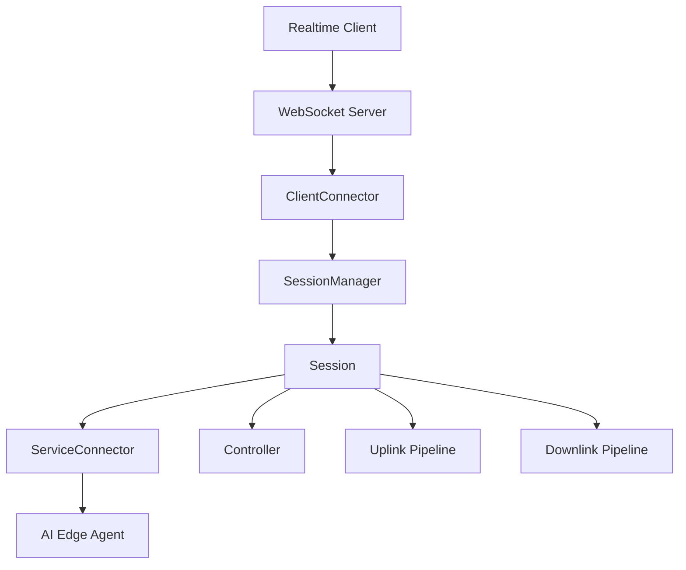

职责分工：

- `internal/websocket` 负责 WSS 接入、端侧 JSON wire event 解析和打包、Ping/Pong RTT 测量。
- `internal/session` 负责每个客户端业务会话的组装、生命周期、上下行 pipeline 桥接和控制消息桥接。
- `internal/connector` 定义客户端连接和服务侧连接的中性接口，不包含端侧 wire event 专用方法。
- `internal/media` 定义媒体帧、格式、方向、pipeline、stage 和 stage event 等媒体模型。
- `internal/pipeline` 提供有界队列 pipeline，每个 stage 拥有独立 goroutine。
- `internal/controller` 负责 VAD 事件、静音关闭、下行参考信号分发等跨管线协调。
- `ServiceConnector` 负责对接 AI Edge Agent，并在 rtc-media-server 与 Agent 之间桥接音频帧、控制消息、文本 delta、TTS PCM 和完成事件。
- `AI Edge Agent` 承载 ASR、Dialogue 和 TTS 能力，对上行音频生成文本、语义回复和下行语音。

## Session 细粒度架构

每个 `X-Hardware-Id` 对应一个客户端连接和一个 `Session`。`SessionManager.Attach` 会为新客户端创建 `Session`，重复连接同一 client id 时复用已有 Session 或由 WebSocket 层拒绝重复 stream。

`Session` 创建时组装以下组件：

- `ClientConnector`：由 WebSocket server 创建，负责端侧连接收发。
- `ServiceConnector`：服务侧连接抽象，负责连接 AI Edge Agent。
- `Controller`：接收 stage 事件和下行 reference tap。
- `Uplink Pipeline`：处理端侧上行音频。
- `Downlink Pipeline`：处理 AI Edge Agent 返回的下行 PCM。

目标 stage chain：

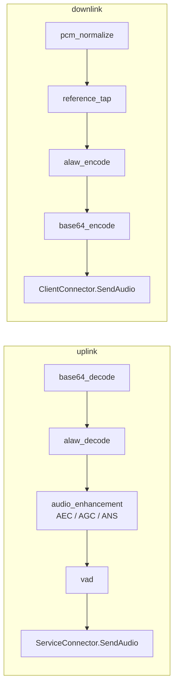

stage chain 由 Session 组装，stage 不直接操作 connector。

## 上行媒体流

端侧发送：

```json
{
  "type": "input_audio_buffer.append",
  "audio": "<g711-alaw-base64>"
}
```

处理路径：

```mermaid
flowchart LR
    JSON["WebSocket JSON"]
    Append["clientConnector.handleInputAudioAppend"]
    FrameIn["media.Frame<br/>Direction: uplink<br/>Codec: base64"]
    Base64["base64_decode"]
    ALaw["alaw_decode"]
    FramePCM["media.Frame<br/>Codec: pcm16le"]
    Enhancement["audio_enhancement<br/>AEC / AGC / ANS"]
    VAD["vad"]
    Service["ServiceConnector.SendAudio"]
    Agent["AI Edge Agent"]

    JSON --> Append --> FrameIn --> Base64 --> ALaw --> FramePCM --> Enhancement --> VAD --> Service --> Agent
```

关键规则：

- 只有 `audio` 字段进入媒体 pipeline。
- 上行输入约定为 G.711 A-law base64。
- `base64_decode` 输出 G.711 A-law bytes。
- `alaw_decode` 输出 PCM16LE，默认 8000 Hz、单声道。
- `audio_enhancement` 负责 AEC、AGC、ANS 等上行音频增强能力。
- `vad` 负责语音起止和静音超时事件，事件由 `Controller` 统一仲裁。
- 处理后的 PCM16LE 音频通过 `ServiceConnector` 投递给 AI Edge Agent。

## 下行媒体流

AI Edge Agent 在收到音频流和 response control 后，返回文本 delta、TTS PCM 和完成事件。

处理路径：

```mermaid
flowchart LR
    Agent["AI Edge Agent"]
    Service["ServiceConnector"]
    Enqueue["Session.EnqueueDownlink"]
    Normalize["pcm_normalize"]
    Reference["reference_tap"]
    ALaw["alaw_encode"]
    Base64["base64_encode"]
    SendAudio["ClientConnector.SendAudio"]
    Delta["WebSocket JSON<br/>response.audio.delta"]

    Agent --> Service --> Enqueue --> Normalize --> Reference --> ALaw --> Base64 --> SendAudio --> Delta
```

关键规则：

- `ServiceConnector` 将 Agent 返回的文本 delta 和 done 转为中性的 `connector.Message`。
- `ServiceConnector` 将 Agent 返回的 TTS PCM 投递给 `Session.EnqueueDownlink`。
- `Session.EnqueueDownlink` 会确保本轮回复先发出 `response.created`。
- `pcm_normalize` 把下行 PCM 归一化到目标 PCM16LE 格式。
- `reference_tap` 在编码前复制一份 PCM 给 `Controller`，作为 AEC 参考信号。
- `alaw_encode` 和 `base64_encode` 把 PCM16LE 转成端侧需要的 G.711 A-law base64。

## 控制消息流

WebSocket connector 将端侧控制 JSON 转成中性的 `connector.Message`，由 `Session.OnClientMessage` 处理。

入站控制消息：

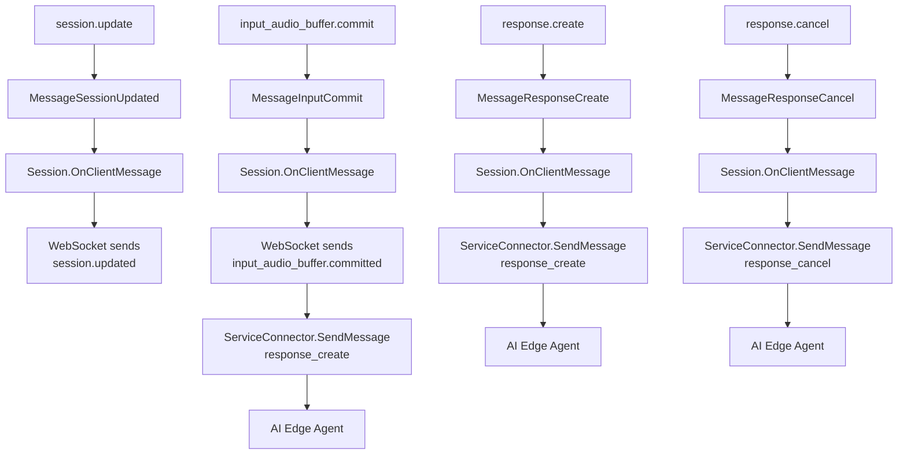

服务侧消息：

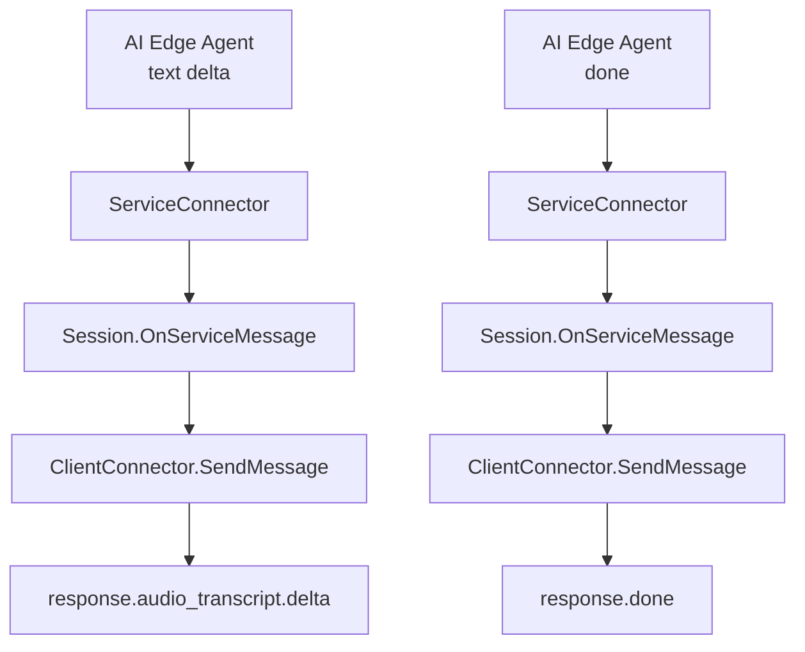

控制消息不进入媒体 pipeline，端侧 wire event 字符串只属于 `internal/websocket`。

## RTT 与参考信号

WebSocket server 后台按 `websocket.rtt_interval` 对在线连接执行 Ping/Pong：

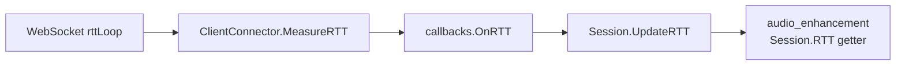

RTT 是连接状态，不写入 `media.Frame`，也不通过 frame metadata 传递。

下行参考信号路径：

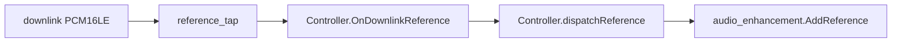

该链路为 AEC 提供下行播放参考，避免上行增强模块直接读取 WebSocket 或下行 connector。

## 生命周期与关闭

连接建立：

1. `WebSocket Server` 校验 `X-Hardware-Id` 并接受 WSS。
2. 为 client id 创建或预留 `clientConnector`。
3. 通过 `OnConnect` 回调调用 `SessionManager.Attach`。
4. `Session` 创建 `Controller`、`ServiceConnector`、上下行 pipeline 和 stage。
5. `ServiceConnector` 建立到 AI Edge Agent 的会话。
6. 绑定 connector 输出端并启动 pipeline。
7. WebSocket connector 发送 `session.created`。

连接断开：

1. WebSocket read loop 退出并 unregister client。
2. `OnDisconnect` 回调调用 `SessionManager.Remove`。
3. `Session.Close` 按固定顺序关闭 `Controller`、上行 pipeline、下行 pipeline、`ServiceConnector`、`ClientConnector`。
4. `ClientConnector` 清理输出端并关闭 `Done` channel。

静音超时：

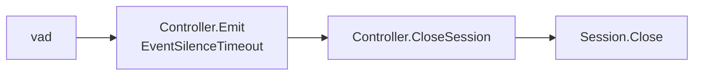

静音超时由 VAD stage 产生，关闭流程统一收敛到 `Session.Close`。
