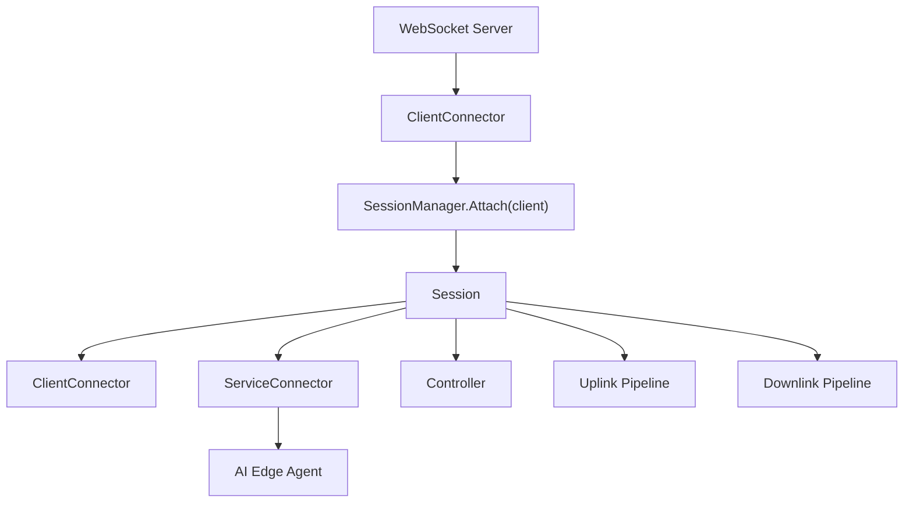
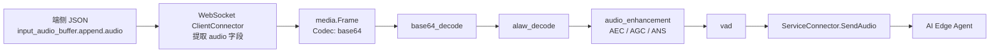
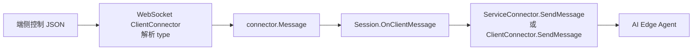
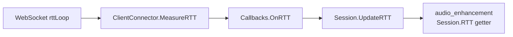
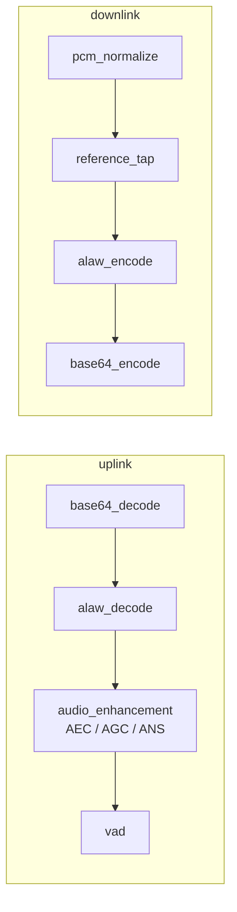
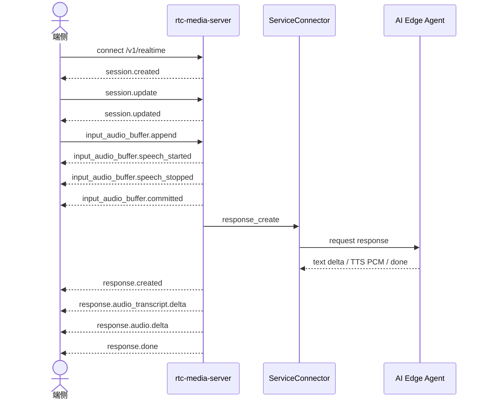

# 架构设计与开发规则

本文档记录 `rtc-media-server` 必须遵守的目标架构边界、数据流和实现规则。文档以最终完整系统为准，目标是让后续开发保持边界清晰、路径直接、避免过度抽象。

## 文档导航

- [项目文档入口](README.md)：项目目标、系统能力和推荐阅读路径。
- [使用说明](Usage.md)：本地启动、配置、测试、WSS 联调事件和运行产物。
- [架构说明](Architecture.md)：全局架构、细粒度架构、数据流、控制流和生命周期。
- [全局架构 Mermaid 图源](uml/global-architecture.mmd)：系统级组件关系。
- [Session 细粒度 Mermaid 图源](uml/session-detail.mmd)：单连接内部组件和 stage chain。
- [联调时序 Mermaid 图源](uml/stream-sequence.mmd)：典型 realtime WebSocket 串流时序。

## 项目目标

`rtc-media-server` 是端侧 realtime WebSocket 与 AI Edge Agent 之间的媒体接入服务。

系统保证：

- 端侧通过 `/v1/realtime` 建立 WSS 连接。
- 端侧上传 G.711 A-law base64 音频，云侧解码为 PCM 后进入上行处理链路。
- 上行 PCM 经过 `audio_enhancement(AEC/AGC/ANS)` 和 `vad` 后，通过 `ServiceConnector` 投递给 AI Edge Agent。
- AI Edge Agent 返回文本 delta、TTS PCM 和结束事件。
- 下行 PCM 经媒体 pipeline 编码为 G.711 A-law base64，再打包为端侧需要的 JSON。

## 核心架构

整体结构如下：

核心规则：

- `WebSocket Server` 是全局监听器，只负责 WSS 接入和客户端连接管理。
- 每个客户端连接创建一个 `ClientConnector`。
- `SessionManager` 只管理 `map[clientID]*Session`，不持有 stage，不直接处理业务协议。
- `Session` 是单客户端业务会话，持有当前客户端 connector、service connector、controller 和双向 pipeline。
- `ServiceConnector` 是 AI Edge Agent 的连接边界，负责服务侧协议适配。
- `Pipeline` 持有 stage，stage 不直接操作 connector。
- `Controller` 只负责跨管线协调，不做音频算法。

## 模块职责边界

### websocket

`internal/websocket` 是端侧 WebSocket 协议适配层。

职责：

- 监听 realtime WebSocket 路径。
- 读取 `X-Hardware-Id` 作为 client/session id。
- 接受认证风格 headers，但当前不校验签名、时间戳、随机数。
- 持有端侧 wire event 常量，例如 `session.created`、`response.audio.delta`。
- 解析端侧完整 JSON。
- 将 `input_audio_buffer.append.audio` 提取为 `CodecBase64` 音频帧并推入上行音频输出端。
- 将控制类 JSON 转成中性的 `connector.Message` 推给 Session。
- 根据 `connector.Message` 类型打包并发送端侧 JSON。
- 通过 WebSocket Ping/Pong 后台测量 RTT。

约束：

- 不处理 3A、VAD、PCM/A-law/base64 媒体算法。
- 不把非音频控制事件送入媒体 pipeline。
- 不在 websocket 内部直接管理 Session 生命周期，只通过回调交给组装层。

### session

`internal/session` 是业务会话编排层。

职责：

- 创建并管理单个客户端的 `ClientConnector`、`ServiceConnector`、`Controller`、上行 pipeline 和下行 pipeline。
- 固定组装目标 stage chain。
- 接收 VAD/Controller 事件，并向 `ClientConnector.SendMessage` 发送中性 `connector.Message`。
- 接收 service 消息，并驱动端侧 response 事件和下行音频投递。
- 保存后台 RTT 测量结果，供音频增强 stage 读取。

约束：

- 不拼端侧 JSON。
- 不持有端侧 wire event 字符串，例如 `session.created`、`response.audio.delta`。
- 不直接解析 WebSocket payload。
- 不引入 factory、registry、noop connector 等当前未使用抽象。

### connector

`internal/connector` 定义连接边界接口。

连接侧输出接口、非媒体消息和交互指令类型属于 connector 边界，包括 `AudioOutput`、`connector.Message`、`MessageOutput` 和 `Message*` 常量。`media` 包只允许放媒体数据模型和媒体 pipeline 抽象。

客户端连接必须提供：

- `BindAudioOutput`：绑定收到外部音频后推送到的输出端。
- `BindMessageOutput`：绑定收到外部消息后推送到的输出端。
- `SendAudio`：向连接另一端发送音频帧。
- `SendMessage`：向连接另一端发送中性消息，由具体 connector 转成自己的协议格式。

通用 connector 接口不能包含端侧协议专用方法，例如 `SendSessionCreated`、`SendSpeechStarted`、`SendResponseDone`。这些 wire event 只属于 WebSocket connector 的内部映射逻辑。

服务侧连接必须提供：

- `BindAudioOutput`：绑定服务侧返回音频后推送到的输出端。
- `BindMessageOutput`：绑定服务侧返回消息后推送到的输出端。
- `SendAudio`：接收上行 pipeline 输出的音频并转发给 AI Edge Agent。
- `SendMessage`：接收 Session 发出的中性控制消息并转发给 AI Edge Agent。

### pipeline

`internal/pipeline` 是媒体处理执行框架。

职责：

- 只处理 `media.Frame`。
- 通过 `stageNode + outputNode` 串联 stage。
- 每个 stage 拥有独立 goroutine。
- stage 之间通过有界 channel 传递帧。
- 负责错误策略、背压和基础统计。

约束：

- pipeline 不处理完整业务 JSON。
- stage 不直接操作 connector。
- stage 不修改 Session 生命周期。
- 当前不使用 stage registry，不从配置动态构建 stage。

### controller

`internal/controller` 是每个 Session 独立持有的跨管线协调器。

职责：

- 接收 VAD 等 stage 抛出的事件。
- 将 speech event 转发给 Session。
- 接收下行 reference tap 的 PCM 副本。
- 异步分发参考信号给 AEC stage。
- 在 silence timeout 时触发 Session 标准关闭流程。

约束：

- Controller 不做音频算法。
- Controller 不直接拼端侧 JSON。
- Controller 不直接读写 WebSocket。

### AI Edge Agent

AI Edge Agent 是服务侧智能能力边界。

职责：

- 接收 `ServiceConnector` 转发的上行 PCM 和控制消息。
- 执行 ASR、Dialogue 和 TTS 能力。
- 返回文本 delta、TTS PCM 和 done。

`rtc-media-server` 只通过 `ServiceConnector` 与 Agent 交互，不让 websocket、pipeline stage 或 controller 直接调用 Agent。

## 数据流

### 上行音频

上行输入音频约定为 G.711 A-law base64，解码后进入 pipeline 的 PCM 为 PCM16LE。

### 下行音频

```mermaid
flowchart LR
    Agent["AI Edge Agent<br/>返回 TTS PCM"]
    Service["ServiceConnector"]
    Enqueue["Session.EnqueueDownlink"]
    Normalize["pcm_normalize"]
    Tap["reference_tap"]
    ALaw["alaw_encode"]
    Base64["base64_encode"]
    SendAudio["ClientConnector.SendAudio"]
    Delta["WebSocket JSON<br/>response.audio.delta"]

    Agent --> Service --> Enqueue --> Normalize --> Tap --> ALaw --> Base64 --> SendAudio --> Delta
```

`reference_tap` 会把编码前的 PCM 副本交给 Controller，再由 Controller 异步分发给 AEC stage。

### 控制消息

控制消息不进入媒体 pipeline。

### RTT

RTT 是连接状态，不写入 `media.Frame`，不通过 frame metadata 传递。

## 端侧协议规则

- 只使用 `/v1/realtime`。
- 不恢复 `/v1/stream`。
- 不新增单独 cmd 通道。
- `X-Hardware-Id` 是唯一 client/session id。
- 可以读取以下认证风格 headers，但当前不校验：
  - `X-Auth-Type`
  - `X-Product-Key`
  - `X-Device-Name`
  - `X-Random-Num`
  - `X-Timestamp`
  - `X-Instance-Id`
  - `X-Signature`
  - `X-Hardware-Id`
- 握手日志可以记录非敏感字段。
- `X-Signature` 不打印完整值，只记录是否存在。
- 收到完整入站 JSON 必须使用 debug 日志打印。
- 发出完整下行 JSON 必须使用 debug 日志打印。

## Stage 规则

目标固定 stage chain：

规则：

- base64、A-law、PCM normalize、3A、VAD、reference tap 都是媒体 stage。
- JSON pack/unpack 不属于媒体 stage。
- VAD 和 3A 是复杂模块，保留在各自目录下。
- 每个 Session 必须创建独立 stage 实例，避免状态串到其他客户端。
- stage 只处理帧，不直接操作 connector。

## 配置说明

外部配置文件为 `configs/config.yaml`。运行时 stage chain 在 `Session` 创建时固定组装，不通过外部配置动态构建 pipeline。

`agent.*` 配置描述 `ServiceConnector` 连接 AI Edge Agent 所需的协议、地址、TLS 和 TTS 参数。

`StreamPath` 字段名仍保留在代码配置结构中，但默认值和实际语义是 realtime WebSocket 通道，即 `/v1/realtime`。

## 日志规则

- 所有运行日志必须使用 `internal/log`。
- 运行日志内容使用英文。
- 客户端相关日志必须以 `client_id=<id>` 开头。
- 代码注释使用中文。
- 不使用 `log/slog`、`fmt.Printf`、`println` 输出运行日志。

## 禁止引入的旧设计残留

除非有明确的新需求，不要恢复以下内容：

- `/v1/stream` 作为可用地址。
- 独立 cmd WebSocket 通道。
- `Endpoint` 命名。
- `SourceOutput`、`PipelineInput` 等已废弃命名。
- `BindInput`、`SendData` 等 Connector 旧接口。
- pipeline registry、stage factory、默认 noop service connector。
- WebSocket 包外拼端侧 JSON wire event。
- Session 包内出现 `session.created`、`response.audio.delta` 等端侧 wire 字符串。
- 通用 `connector.ClientConnector` 接口中出现端侧协议专用发送方法。
- `internal/media` 中出现 `AudioOutput`、非媒体消息模型或交互指令常量。

## 典型联调时序

